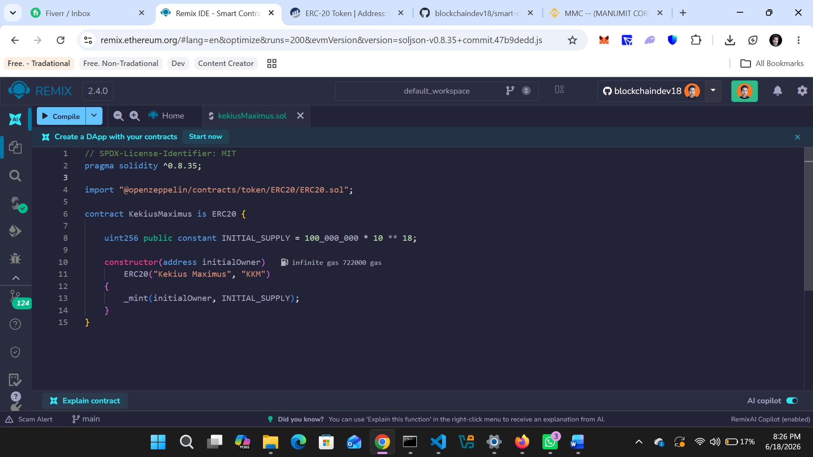
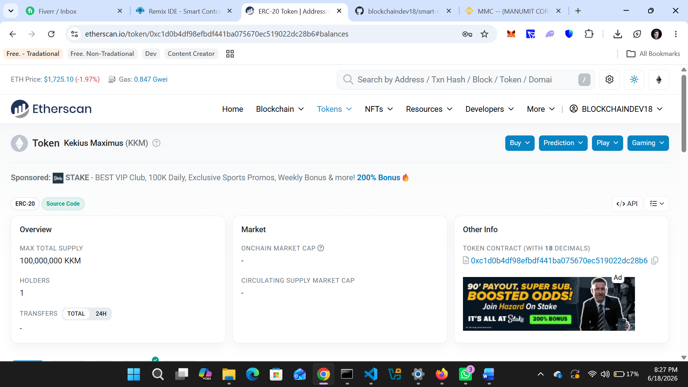
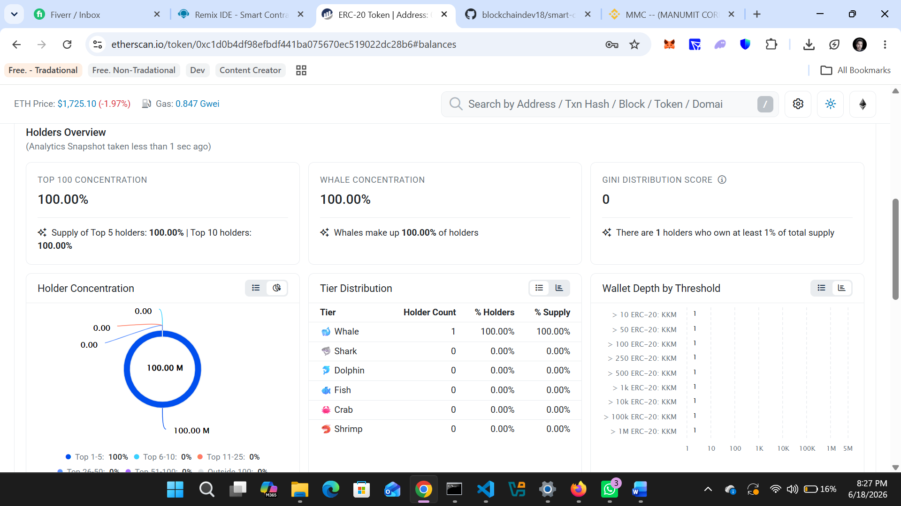
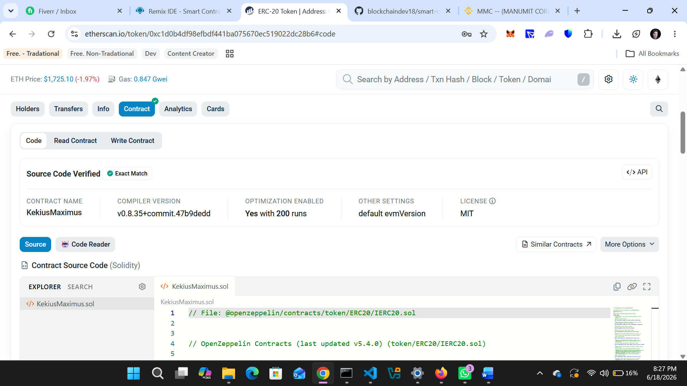
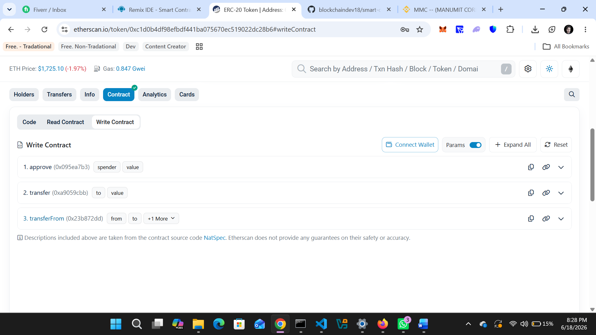
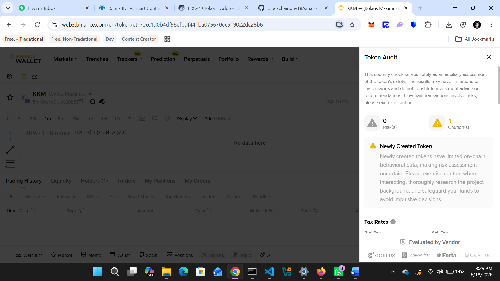

# 🪙 ManumitCoreToken (MMC)

## 📌 Overview
MANUMIT CORE (MMC) is an ERC-20 token built on the Ethereum blockchain using OpenZeppelin secure smart contract standards. The project is designed with a fixed supply model and transparent token allocation structure to ensure trust and verifiability.

The token is deployed on both testnet and mainnet environments for full lifecycle testing, including functionality validation, security verification, and real-world deployment readiness.
---

## 🌐 Network Deployments

### 🧪 Testnet Deployment
- Network: Sepolia
- Contract Address: 0xbd79700681B62E3F02c0F23c99B242E27a7DFC19
- Explorer: https://sepolia.etherscan.io/address/0xbd79700681B62E3F02c0F23c99B242E27a7DFC19
- Purpose: Testing

---

### 🚀 Mainnet Deployment
- Network: Ethereum Mainnet
- Contract Address: 0xbd79700681B62E3F02c0F23c99B242E27a7DFC19
- Explorer: https://etherscan.io/address/0xbd79700681B62E3F02c0F23c99B242E27a7DFC19
- Purpose: Production

---

## ⚙️ Token Details
- Token Name: MANUMIT CORE
- Symbol: MMC
- Decimals: 18
- Total Supply: 6,000,000,000
- Standard: ERC-20
- Blockcahin: Ethereum

---

## 🔐 Smart Contract Features

- ERC-20 Standard Implementation (OpenZeppelin)
- Secure and audited OpenZeppelin contracts
- Fixed total supply model (no inflation)
- Ownership control using Ownable
- No backdoors or hidden mint functions
- Fully tested on testnet before mainnet deployment

---

## 🪙 Token Requirements

### Token Standard
ERC-20 (Ethereum)

### Token Name
MANUMIT CORE

### Token Symbol
MMC

### Total Supply
6,000,000,000 MMC

---

## 📊 Token Allocation & Lock Structure

- 4,500,000,000 MMC will be unlocked and available at launch
- 1,500,000,000 MMC will remain locked until **9 July 2028**
- Lock mechanism will be enforced at smart contract level (time-based or vesting logic)

---

## 🔐 Ownership & Control

- Contract ownership will be transferred to the client wallet after deployment
- No centralized control after ownership transfer (if renounced option is used)
- Fully transparent and verifiable on-chain logic

---

🔍 Verification

Contract is verified on Etherscan:

Testnet: Verified
Mainnet: Verified

---

🔐 Security Statement

Built using audited OpenZeppelin libraries
No malicious functions or hidden mint logic
Fully transparent and verifiable source code
Tested extensively on testnet before mainnet deployment

---

## 📸 Testnet Screenshots

    

    

    

    

    

    

    

    
<p

---

## ⚠️ Audit Summary

- **1 Risk detected** (vesting-related)
- **1 Caution detected** (newly deployed token)

The risk is associated with the vesting mechanism; after vesting completion, ownership renouncement may resolve this flag. The caution is due to the token being newly deployed, which is a standard initial warning.

**No additional critical issues were detected.**